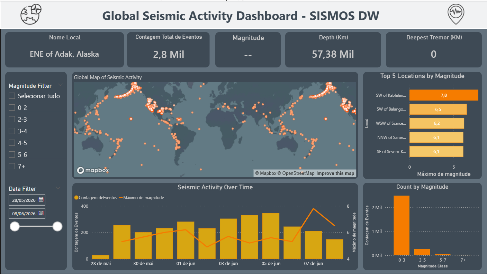

# 🌍 Pipeline de Dados e Monitoramento Sísmico (Airflow + Power BI)

Este projeto consiste em uma infraestrutura completa de Engenharia de Dados (End-to-End). O pipeline extrai dados de terremotos em tempo real via API, realiza o tratamento da informação, armazena em um banco de dados e exibe as métricas em um painel analítico interativo.

## 📊 O Dashboard
O relatório foi construído no Microsoft Power BI e fornece uma visão geoespacial e analítica da atividade sísmica global, permitindo filtragem dinâmica por magnitude, data e profundidade.

## ⚙️ Arquitetura e Fluxo de Dados (ETL)
A automação e confiabilidade do fluxo de dados são os grandes destaques desta arquitetura:

1. **Orquestração (Apache Airflow):** Todo o fluxo de dados é gerenciado por uma DAG no Apache Airflow, configurada com um gatilho de agendamento (cron) para rodar automaticamente **a cada 4 horas**.
2. **Extração e Tratamento (Python):** O Airflow aciona um script Python responsável por fazer o request na API pública de sismologia. Esse mesmo script roda em memória a transformação dos dados (limpeza de nulos, conversão de tipos e categorização) antes de seguir para o banco.
3. **Carga / Armazenamento (Banco de Dados):** O dataframe limpo é inserido (append/merge) no banco de dados relacional, mantendo o histórico de sismos atualizado.
4. **Consumo (Power BI):** O dashboard se conecta diretamente ao banco para refletir as atualizações contínuas geradas pelo pipeline.

## 💻 Estrutura do Repositório

* `/scripts/`: Contém os códigos fonte em Python responsáveis pela extração e tratamento dos dados.
* `/dags/`: Contém o arquivo de orquestração do Apache Airflow.
* `/img/`: Imagens e capturas de tela do projeto.
* `/dashboard/`: Arquivo `.pbix` do painel do Power BI.

## 🛠️ Stack Tecnológica
* **Linguagem:** Python (Pandas, Requests)
* **Orquestração:** Apache Airflow
* **Armazenamento:** PostgreSQL / Banco Relacional
* **Visualização:** Microsoft Power BI / DAX
